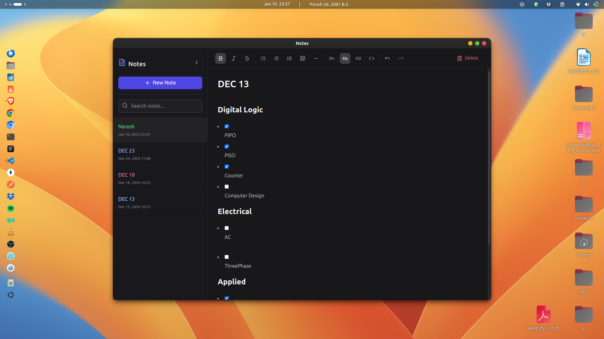

# Notes Desktop App

A minimalist, cross-platform desktop notes application built with Electron, React, and TypeScript. Features a clean interface for managing and editing notes with rich text support.



## Features

- 🎯 Clean, minimalist interface
- 📝 Rich text editing capabilities
- 🔍 Fast note search
- 💾 Automatic saving
- 🎨 Dark mode interface
- ⌨️ Keyboard shortcuts support
- 📱 Responsive design

## Technology Stack

- **Frontend**: React, TypeScript, TailwindCSS
- **State Management**: Redux Toolkit
- **Editor**: TipTap
- **Desktop Framework**: Electron
- **Build Tool**: Vite
- **Package Manager**: Yarn

## Prerequisites

Before you begin, ensure you have the following installed:

- Node.js (v16 or later)
- Yarn package manager
- Linux operating system (currently only Linux build is available)

## Installation

1. Clone the repository:

```bash
git clone https://github.com/f0rsakeN-afk/notes-desktop.git
cd notes-desktop
```

2. Install dependencies:

```bash
yarn install
```

3. Start the development server:

```bash
yarn dev
```

## Building the Application

To build the application for Linux:

```bash
yarn build:linux
```

The built application will be available in the `dist` directory.

## Known Limitations

- Currently only available for Linux systems
- Performance optimizations are needed for larger note collections
- Some features may require additional refinement

### Contributing

1. Fork the repository
2. Create your feature branch (`git checkout -b feature/AmazingFeature`)
3. Commit your changes (`git commit -m 'Add some AmazingFeature'`)
4. Push to the branch (`git push origin feature/AmazingFeature`)
5. Open a Pull Request

## Technical Considerations

- The application uses a file-based storage system
- IPC communication is handled through a secure bridge
- Rich text editing is implemented using TipTap
- State management is handled by Redux Toolkit

## Security

- Context isolation is enabled
- Remote content execution is disabled
- Secure IPC communication implementation
- Sandboxed renderer process

---

**Note**: This project is under active development. Some features may be experimental or incomplete.
